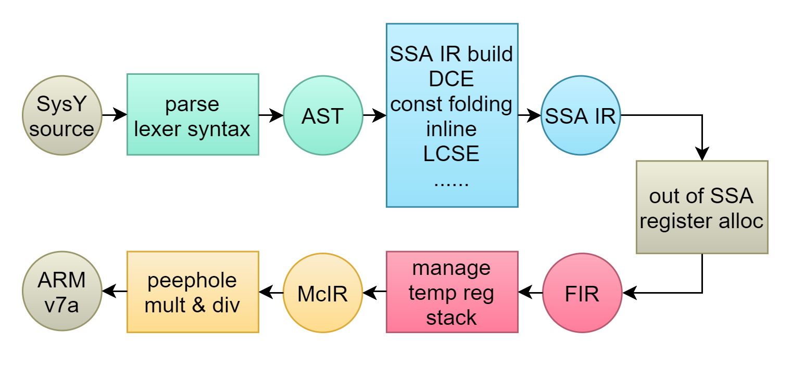

# Whitee

[](README.zh-CN.md) [](https://www.cplusplus.com/) [](https://gitlab.eduxiji.net/nscscc/compiler2021/-/blob/master/SysY%E8%AF%AD%E8%A8%80%E5%AE%9A%E4%B9%89.pdf) [](https://developer.arm.com/) [](https://github.com/Forever518/Whitee)

Whitee is a tiny compiler written in C++17, which translates SysY language into ARM-v7a assembly.

## Table of Contents

* [Background](#Background)
* [Install](#Install)
* [Usage](#Usage)
* [Architecture](#Architecture)
* [Contributing](#Contributing)

## Background

Whitee is the final work of team *Good Morning! Whitegivers* with a wild card in 2021 Huawei Bisheng Cup Compilation System Design Competition, which ranked 5th in the final and won the 2nd prize.

* **SysY language**: a subset of C language, whose source code is usually stored in a file with the extension *sy*. Only one *main* function is allowed in SysY, which supports global variable declaration, constant declaration, other function definitions, etc. For more details see [SysY-Language-Definition.pdf](https://gitlab.eduxiji.net/nscscc/compiler2021/-/blob/master/SysY%E8%AF%AD%E8%A8%80%E5%AE%9A%E4%B9%89.pdf).
* **SysY runtime library**: the library provides a series of I/O functions and timing functions. For more details see [SysY-Runtime-Library.pdf](https://gitlab.eduxiji.net/nscscc/compiler2021/-/blob/master/SysY%E8%BF%90%E8%A1%8C%E6%97%B6%E5%BA%93.pdf).
* **target platform**: Raspberry 4B with Raspberry Pi OS(Raspbian GNU/Linux 10).

## Install

### Environment

* Make 4.2+
* CMake 3.13+
* GCC 9.3+ or other compilers supporting C++17

### Steps

```sh
$ git clone https://github.com/Forever518/Whitee.git
$ mkdir Whitee/build/ && cd Whitee/build/
$ cmake .. && make -j 8
```

## Usage

```sh
$ ./whitee [-S] [-o] [-h | --help] [-d | --debug <level>] [-c | --check <level>] [--set-debug-path=<path>] <target-file> <source-file> [-O <level>]
```

### Options

* `-S`: generate assembly, can be omitted.
* `-o`: set output file, can be omitted.
* `-h`,  `--help`: show usage.
* `-d <level>`, `--debug <level>`: dump debug messages to certain files.
  * level 1: dump IR and optimized IR.
  * level 2: append AST.
  * level 3: append Lexer, each Optimization Pass and Register Allocation.
* `-c <level>`, `--check <level>`: check IR's relation.
  * level 1: check IR and final optimized IR only.
  * level 2: check IR after each optimization pass.
* `--set-debug-path=<path>`: set debug messages output path, default the same path with target assembly file.
* `<target-file>`: target assembly file in ARM-v7a.
* `<source-file>`: source code file matching SysY grammar.
* `-O <level>`: set optimization level, default non-optimization `-O0`.

### Additional Details

* When the debug-path is not set and the option `-d` or `--debug` is used, the compiler will dump debug messages to the same directory with target assembly file as `whitee-debug-<target-file>`.  Each message is dumped to its target file:
  * IR: `ir.txt`
  * AST: `ast.txt`
  * FIR: `ir_final.txt`
  * optimized IR: `ir_optimized.txt`
  * lexer vector: `lexer.txt`
  * conflict graph of variables in FIR(taking id in IR as identification): `ir_conflict_graph.txt`
  * result of global register allocation(taking id in IR as identification): `ir_register_alloc.txt`
  * IR after each pass: directory `optimize` under debug-path.
* The option `-c` or `--check` can make the compiler check IR's realtion after IR successfully built or each optimized pass, helping developers find more problems and bugs.
* The option `-O` will set the optimization level.
  * `-O0`: only *constant propagation*, *copy propagation* and *temporary register allocation*.
  * `-O1`: append *dead code elimination*, *constant folding*, *assembly peephole optimization*, etc.
  * `-O2`: append *multiplication & division optimization*, *function inlining*, etc.
  * `-O3`: append *local array propagation*, *constant array globalization*, etc.
* The target assembly directory or the debug path will be created when not exists.


## Architecture



### front-end optimize

* Strength Reduction
* Simple Loop Unrolling

### SSA IR building optimize

* Constant Propagation
* Copy Propagation
* Loop Structure Simplification

### SSA IR optimize

* Dead Code Elimination
* Constant Folding（including Peephole Optimization）
* Function Inlining Conditionally
* Local Common Subexpression Elimination
* Loop Invariant Code Motion
* Advanced Dead Code Elimination 
* Basic Block Merging and Elimination
* Read-only Global Variable or Array to Constant
* Local Array Propagation
* Write-only Global Variable or Array Elimination

### FIR optimize

* Global Register Allocation based on Graph Coloring

### MIR optimize

* Constant Multiplication & Division Simplification
* Assembly Peephole Optimization

## Contributing

All 4 members of team *Good Morning! Whitegivers*。

* [Forever518](https://github.com/Forever518)
* [T-Muller](https://github.com/T-Muller)
* [willipwk](https://github.com/willipwk)
* [violet73](https://github.com/violet73)