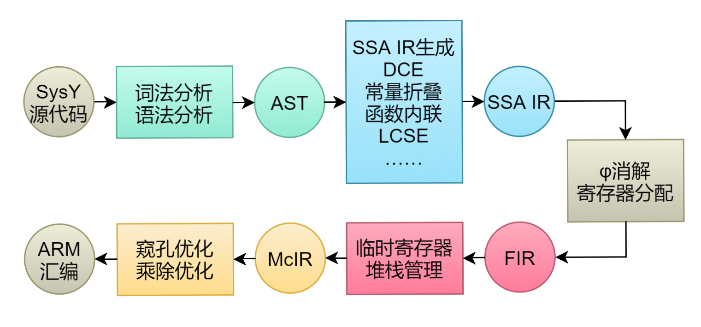

# Whitee

[](LICENSE) [](https://www.cplusplus.com/) [](https://gitlab.eduxiji.net/nscscc/compiler2021/-/blob/master/SysY%E8%AF%AD%E8%A8%80%E5%AE%9A%E4%B9%89.pdf) [](https://developer.arm.com/) [](https://github.com/Forever518/Whitee)

Whitee是一款使用C++17开发的小型编译器，能够将SysY语言编译为ARM-v7a汇编。

## 目录

* [背景](#背景)
* [安装](#安装)
* [使用说明](#使用说明)
* [架构](#架构)
* [贡献者](#贡献者)
* [许可证](#许可证)

## 背景

2021全国大学生计算机系统能力大赛编译系统设计赛（华为毕昇杯）*早安！白给人*外卡赛队作品，决赛排名第5，获二等奖。

* **SysY语言**：C语言的一个子集，源码通常存储在扩展名为sy的文件中，仅允许出现一个名为main的函数。SysY支持全局变量声明、常量声明和其他函数定义等，详见[SysY语言定义.pdf](https://gitlab.eduxiji.net/nscscc/compiler2021/-/blob/master/SysY%E8%AF%AD%E8%A8%80%E5%AE%9A%E4%B9%89.pdf)。
* **SysY运行时库**：提供一系列的I/O函数、计时函数等，详见[SysY运行时库.pdf](https://gitlab.eduxiji.net/nscscc/compiler2021/-/blob/master/SysY%E8%BF%90%E8%A1%8C%E6%97%B6%E5%BA%93.pdf)。
* **目标平台**：Raspberry Pi OS（Raspbian GNU/Linux 10）操作系统和ARM Cortex-A72 CPU的Raspberry 4B设备。

## 安装

### 环境

* Make 4.2+
* CMake 3.13+
* GCC 9.3+或其他支持C++17的编译器

### 安装步骤

```sh
$ git clone https://github.com/Forever518/Whitee.git
$ mkdir Whitee/build/ && cd Whitee/build/
$ cmake .. && make -j 8
```

## 使用说明

```sh
$ ./whitee [-S] [-o] [-h | --help] [-d | --debug <level>] [-c | --check <level>] [--set-debug-path=<path>] <target-file> <source-file> [-O <level>]
```

### 选项

* `-S`：生成汇编，可省略。
* `-o`：设置输出文件，可省略。
* `-h`， `--help`：显示使用说明。
* `-d <level>`，`--debug <level>`：将编译时的调试信息输出到特定文件。
  * level 1：输出IR和优化后IR。
  * level 2：追加AST。
  * level 3：追加词元向量、每一遍优化IR和寄存器分配信息。
* `-c <level>`，`--check <level>`：检查IR关系正确性。
  * level 1：仅检查初始IR和最终优化后IR。
  * level 2：在每一遍优化后都进行检查。
* `--set-debug-path=<path>`：设置调试信息输出路径，默认与目标汇编文件位于同一目录。
* `<target-file>`：目标ARM-v7a汇编文件。
* `<source-file>`：源SysY文件。
* `-O <level>`：设置优化等级（0至3），默认为无优化`-O0`。

### 补充说明

* `-d`和`--debug`选项在不设置输出路径时，将把信息输出到与目标代码同目录下的`whitee-debug-<target-file>`路径，各信息输出目标文件为：
* IR：`ir.txt`
  * AST：`ast.txt`
  * 最终IR：`ir_final.txt`
  * 优化后IR：`ir_optimize.txt`
  * 词元向量：`lexer.txt`
  * 变量冲突图（以IR中id作为标识）：`ir_conflict_graph.txt`
  * 寄存器分配结果（以IR中id作为标识）：`ir_register_alloc.txt`
  * 每一遍优化后IR：`optimize`目录。

* `-c`和`--check`选项用于开启IR关系的检查，能够帮助开发者锁定到更多问题。

* `-O`选项将设置优化等级。
  * `-O0`：仅开启IR构建时的常量传播、复制传播，临时寄存器分配。
  * `-O1`：追加死代码删除、常量折叠、汇编窥孔优化等。
  * `-O2`：追加乘除优化、函数内联等。
  * `-O3`：追加局部数组传播、常量数组全局化等。

* 目标代码所在目录、调试信息目录不存在时将会被创建。


## 架构



### 前端优化

* 运算强度削弱
* 简单循环展开

### SSA IR生成优化

* 常量传播
* 复制传播
* 循环结构化简

### SSA IR优化

* 死代码删除
* 常量折叠（含窥孔优化）
* 条件函数内联
* 局部公共子表达式删除
* 循环不变量外提
* 进阶死代码删除
* 基本块合并与删除
* 只读变量常量化
* 局部数组传播
* 只写变量删除

### FIR优化

* 基于图着色的全局寄存器分配

### MIR优化

* 常数乘除化简
* 汇编窥孔优化

## 贡献者

*早安！白给人*赛队四位成员。

* [Forever518](https://github.com/Forever518)
* [T-Muller](https://github.com/T-Muller)
* [willipwk](https://github.com/willipwk)
* [violet73](https://github.com/violet73)

## 许可证

[GPL-3.0 License © Dihao Fan, Zhenwei Liu, Weikun Peng, Kelun Lei](LICENSE)
